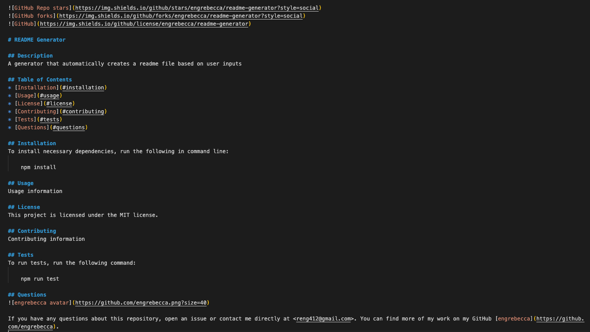
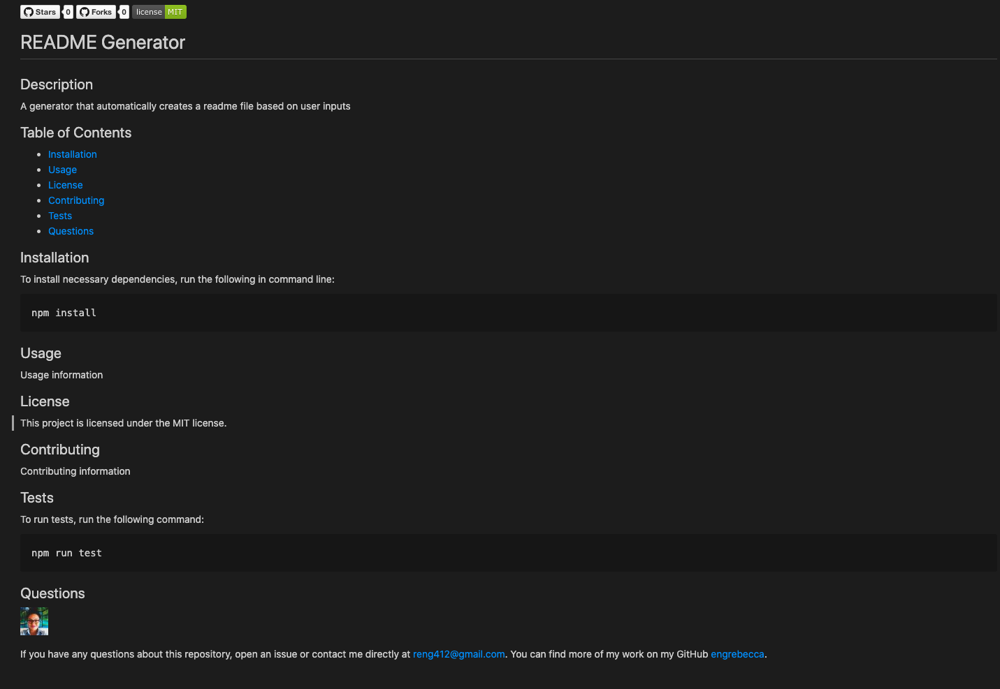

# README Generator

## Description
The README Generator allows developers to automatically create a README file through a few simple prompts in command line. It generates key information sections such as title, description, badges, table of contents, installation, usage, license, contributing, tests, and questions. It allows developers to create a quality README to use as is or to build off of. By spending less time creating a README, developers can focus their time on building more projects.

## Table of Contents
* [Installation](#installation)
* [Usage](#usage)
* [License](#license)
* [Contributing](#contributing)
* [Tests](#tests)
* [Questions](#questions)

## Installation
This program utilizes the Inquirer package. To install necessary dependencies, run the following in command line:

    npm install

## Usage
1. Install necessary dependencies through the command "npm install"
2. Initiate the generator with the command "node index.js"
3. Respond to the questions that are prompted in command line
4. Once all prompts are finished you will see "Writing README" consoled and a README file will be created in the folder
5. Open and preview the README file
6. Use the file as is or add any additional information such as images, code snippets, etc 

## Built With
* [Inquirer.js](https://www.npmjs.com/package/inquirer) - a Node.js package that provides functionality to ask questions in the command line interface
* [Node.js](https://nodejs.org/en/) - a JavaScript runtime environment that allows JavaScript to be run in command line
* [JavaScript](https://developer.mozilla.org/en-US/docs/Web/JavaScript) - code that creates the logic and structure of the program
* [Git](https://git-scm.com/) - version control system to track changes in source code
* [GitHub](https://github.com/) - hosts repository and deploys page on GitHub

## Sample Result Pictures
A sample markdown file that is generated

A preview of a sample generated README file 

## License
This project is licensed under the MIT license.

## Contributing
If you are interested in contributing to this repository, please contact me at the email below. 

## Tests
To run tests, run the following command:

    npm test

## Credits
* Badges from [ShieldsIO](https://shields.io/)

## Questions
If you have any questions about this repository, please open an issue or contact me directly at <reng412@gmail.com> or on [LinkedIn](https://www.linkedin.com/in/engrebecca/). You can find more of my work on my GitHub [engrebecca](https://github.com/engrebecca).
